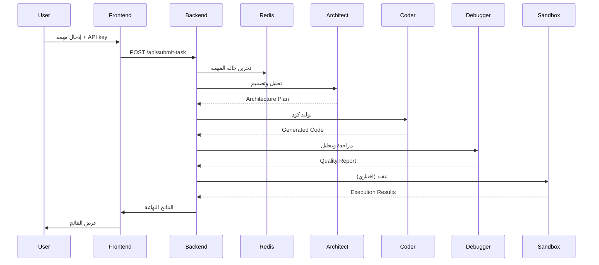

# 🚀 OpenDevAgent - منصة مهندس البرمجيات بالذكاء الاصطناعي

<div align="center">


**منصة متقدمة لتطوير البرمجيات بالذكاء الاصطناعي المتعدد الوكلاء**

[الميزات](#-الميزات) • [التثبيت](#-التثبيت-السريع) • [الاستخدام](#-الاستخدام) • [المعمارية](#-المعمارية) • [المساهمة](#-المساهمة)

</div>

---

## 📖 نظرة عامة

**OpenDevAgent** هي منصة شاملة ومتطورة لهندسة البرمجيات تعمل بالذكاء الاصطناعي، مستوحاة من معمارية **Kilo Code**. تستخدم المنصة نظام **وكلاء متعددين (Multi-Agent)** للعمل وفق حلقة **Plan-Act-Observe-Fix** لتوليد، تنفيذ، ومراجعة الكود بشكل تلقائي وذكي.

### 🎯 ما الذي يميز OpenDevAgent؟

- 🤖 **نظام وكلاء متعدد متخصص**: ثلاثة وكلاء ذكاء اصطناعي متخصصين (معماري، مطور، مصحح)
- 🔄 **حلقة تطوير ذاتية**: Plan-Act-Observe-Fix لضمان جودة الكود
- 🔒 **تنفيذ آمن**: بيئة sandbox معزولة باستخدام Docker
- 🌐 **تكامل OpenRouter**: وصول موحد لأفضل نماذج الذكاء الاصطناعي
- 🎨 **واجهة حديثة**: تصميم عصري مستوحى من Capy.ai
- 🚀 **قابل للتوسع**: معمارية microservices جاهزة للإنتاج
- 🔐 **آمن**: إدارة آمنة لمفاتيح API بدون تخزين

## ✨ الميزات

### 🏗️ نظام الوكلاء المتعددين

#### 1️⃣ Architect Agent (المعماري)
- 🔷 **النموذج**: `openai/gpt-4o`
- 🎯 **المهمة**: تصميم معمارية النظام وتخطيط المشروع
- 📋 **المخرجات**: 
  - وثيقة معمارية شاملة
  - مخطط المكونات
  - تدفق البيانات
  - استراتيجية التطوير

#### 2️⃣ Coder Agent (المطور)
- 🔷 **النموذج**: `anthropic/claude-3.5-sonnet`
- 🎯 **المهمة**: توليد كود جاهز للإنتاج
- 📋 **المخرجات**:
  - كود كامل مع أفضل الممارسات
  - معالجة الأخطاء
  - تعليقات توضيحية
  - ملفات الإعداد
  - وثائق README

#### 3️⃣ Debugger Agent (المصحح)
- 🔷 **النموذج**: `anthropic/claude-3.5-sonnet`
- 🎯 **المهمة**: مراجعة الكود وضمان الجودة
- 📋 **المخرجات**:
  - تقرير جودة شامل
  - تحليل الأمان
  - توصيات التحسين
  - اقتراحات الاختبارات

### 🛠️ التقنيات المدعومة

<table>
  <tr>
    <th>اللغة</th>
    <th>الأطر المدعومة</th>
    <th>البيئة</th>
  </tr>
  <tr>
    <td>🐍 Python</td>
    <td>FastAPI, Django, Flask, SQLAlchemy</td>
    <td>python:3.11-slim</td>
  </tr>
  <tr>
    <td>📜 JavaScript/TypeScript</td>
    <td>React, Next.js, Express, Vue, Angular</td>
    <td>node:20-alpine</td>
  </tr>
  <tr>
    <td>☕ Java</td>
    <td>Spring Boot, Maven, Gradle</td>
    <td>openjdk:21-slim</td>
  </tr>
  <tr>
    <td>🦫 Go</td>
    <td>Gin, Echo, Chi</td>
    <td>golang:1.22-alpine</td>
  </tr>
  <tr>
    <td>🦀 Rust</td>
    <td>Actix, Rocket, Tokio</td>
    <td>rust:latest</td>
  </tr>
  <tr>
    <td>⚡ C++</td>
    <td>Qt, CMake, Boost</td>
    <td>gcc:latest</td>
  </tr>
</table>

### 🔒 Secure Sandbox Executor

- **العزل الكامل**: كل مهمة تعمل في حاوية Docker منفصلة
- **قيود الموارد**:
  - الذاكرة: 512MB
  - CPU: 50% من نواة واحدة
  - الوقت: 5 دقائق timeout
- **عزل الشبكة**: لا يوجد وصول للإنترنت
- **تنظيف تلقائي**: حذف الموارد بعد التنفيذ

### 🎨 واجهة المستخدم

- ✅ **ApiKeyInputForm**: إدخال آمن لمفتاح OpenRouter
- ✅ **TaskCreationWizard**: معالج خطوة بخطوة لإنشاء المهام
- ✅ **AgentStatusDashboard**: متابعة حية لحالة الوكلاء
- ✅ **RealTimeLogViewer**: عرض السجلات المباشرة
- ✅ **NotificationSystem**: إشعارات ديناميكية

## 🚀 التثبيت السريع

### المتطلبات الأساسية

- Docker & Docker Compose
- مفتاح API من [OpenRouter](https://openrouter.ai/keys)
- Git

### خطوات التثبيت

```bash
# 1. استنساخ المشروع
git clone https://github.com/yourusername/OpenDevAgent.git
cd OpenDevAgent

# 2. إعداد متغيرات البيئة
cp .env.example .env

# 3. تشغيل المشروع
docker-compose up --build -d

# 4. انتظر حتى يصبح كل شيء جاهزاً (1-2 دقيقة)
docker-compose logs -f

# 5. افتح المتصفح
# Frontend: http://localhost:3000
# Backend API: http://localhost:8000
# API Docs: http://localhost:8000/docs
```

### التثبيت اليدوي (بدون Docker)

#### Backend

```bash
cd backend
python -m venv venv
source venv/bin/activate  # Windows: venv\Scripts\activate
pip install -r requirements.txt
uvicorn main:app --reload
```

#### Frontend

```bash
cd frontend
npm install
npm run dev
```

## 📚 الاستخدام

### 1. إدخال مفتاح API

```typescript
// احصل على مفتاح من: https://openrouter.ai/keys
// أدخله في واجهة المستخدم
// المفتاح يُخزن في الذاكرة فقط ولا يُحفظ على الخادم
```

### 2. إنشاء مهمة جديدة

```yaml
الخطوة 1 - وصف المهمة:
  مثال: "إنشاء REST API لإدارة المهام مع FastAPI و SQLAlchemy"

الخطوة 2 - اختيار التقنية:
  اللغة: Python
  الإطار: FastAPI
  
الخطوة 3 - تحديد التعقيد:
  الخيارات: منخفض / متوسط / عالي
```

### 3. متابعة التنفيذ

```
📐 PLAN Phase:
   Architect Agent يصمم المعمارية...
   ✅ Architecture completed (30s)

⚡ ACT Phase:
   Coder Agent يولد الكود...
   ✅ Code generation completed (45s)

🔍 OBSERVE & FIX Phase:
   Debugger Agent يراجع الكود...
   ✅ Review completed (20s)

✨ Task completed successfully!
```

### 4. الحصول على النتائج

```json
{
  "architecture": "وثيقة معمارية مفصلة...",
  "code": "كود Python كامل مع FastAPI...",
  "review": "تقرير مراجعة شامل..."
}
```

## 🏗️ المعمارية

### نظرة عامة

```
┌─────────────┐
│   Frontend  │  Next.js + React + Tailwind CSS
│  Port: 3000 │  
└──────┬──────┘
       │ REST API
┌──────▼──────┐
│   Backend   │  FastAPI + CrewAI + LangChain
│  Port: 8000 │
└──────┬──────┘
       │
   ┌───┴────┬─────────┬─────────┐
   │        │         │         │
┌──▼──┐ ┌──▼──┐ ┌────▼───┐ ┌──▼──┐
│Arch │ │Coder│ │Debugger│ │Redis│
│Agent│ │Agent│ │ Agent  │ │Cache│
└─────┘ └─────┘ └────────┘ └─────┘
                     │
              ┌──────▼──────┐
              │   Sandbox   │
              │   Executor  │
              └─────────────┘
```

### تدفق البيانات



للمزيد من التفاصيل، راجع [KILO_ARCHITECTURE_AR.md](./KILO_ARCHITECTURE_AR.md)

## 📡 API Endpoints

### Authentication

```http
POST /api/validate-key
Content-Type: application/json

{
  "api_key": "sk-or-v1-..."
}
```

### Submit Task

```http
POST /api/submit-task
Content-Type: application/json

{
  "api_key": "sk-or-v1-...",
  "description": "وصف المهمة",
  "language": "Python",
  "framework": "FastAPI",
  "complexity": "medium"
}
```

### Get Task Status

```http
GET /api/task_status/{task_id}
```

### Get Task Logs

```http
GET /api/task_logs/{task_id}
```

### Health Check

```http
GET /api/health
```

للوثائق التفاعلية الكاملة: `http://localhost:8000/docs`

## ⚙️ الإعدادات

### متغيرات البيئة

قم بتحرير ملف `.env`:

```env
# OpenRouter API
OPENROUTER_API_KEY=sk-or-v1-...  # اختياري (يُدخل من الواجهة)

# Backend
PYTHONUNBUFFERED=1
LOG_LEVEL=INFO
REDIS_URL=redis://redis:6379

# Frontend
NEXT_PUBLIC_API_URL=http://localhost:8000

# Sandbox
SANDBOX_TIMEOUT=300
SANDBOX_MEMORY_LIMIT=512m
SANDBOX_CPU_QUOTA=50000

# Models
ARCHITECT_MODEL=openai/gpt-4o
CODER_MODEL=anthropic/claude-3.5-sonnet
DEBUGGER_MODEL=anthropic/claude-3.5-sonnet
FALLBACK_MODEL=meta-llama/llama-3.1-70b
```

### تخصيص النماذج

يمكنك تغيير النماذج في `backend/agent_logic/software_engineer_crew.py`:

```python
# استخدام نماذج مختلفة
self.architect_llm = self._create_llm("openai/gpt-4-turbo", temperature=0.7)
self.coder_llm = self._create_llm("google/gemini-pro", temperature=0.5)
self.debugger_llm = self._create_llm("anthropic/claude-3-opus", temperature=0.3)
```

## 🧪 الاختبار

### Backend Tests

```bash
cd backend
pytest tests/ -v
```

### Frontend Tests

```bash
cd frontend
npm test
npm run test:e2e
```

### Integration Tests

```bash
docker-compose -f docker-compose.test.yml up --abort-on-container-exit
```

## 📊 المراقبة والسجلات

### عرض سجلات Backend

```bash
docker-compose logs -f backend
```

### عرض سجلات Frontend

```bash
docker-compose logs -f frontend
```

### مراقبة Redis

```bash
docker exec -it opendev-redis redis-cli
> INFO stats
> MONITOR
```

### استخدام الموارد

```bash
docker stats
```

## 🚀 النشر على الإنتاج

### Railway (موصى به)

```bash
# تثبيت Railway CLI
npm install -g @railway/cli

# تسجيل الدخول
railway login

# إنشاء مشروع جديد
railway init

# نشر
railway up
```

### Heroku

```bash
heroku create opendevagent
heroku stack:set container
git push heroku main
```

### AWS / GCP / Azure

راجع:
- [DEPLOY_AWS.md](./DEPLOY_AWS.md)
- [DEPLOY_GCP.md](./DEPLOY_GCP.md)
- [DEPLOY_AZURE.md](./DEPLOY_AZURE.md)

## 🔧 استكشاف الأخطاء

### المشكلة: Docker containers لا تبدأ

```bash
# تحقق من الحالة
docker-compose ps

# أعد البناء
docker-compose down -v
docker-compose up --build
```

### المشكلة: Frontend لا يتصل بـ Backend

```bash
# تحقق من NEXT_PUBLIC_API_URL
echo $NEXT_PUBLIC_API_URL

# يجب أن يكون: http://localhost:8000
```

### المشكلة: مفتاح API غير صالح

```bash
# تحقق من مفتاحك على:
# https://openrouter.ai/keys

# تأكد من أن المفتاح يبدأ بـ: sk-or-v1-
```

### المشكلة: Sandbox execution فشل

```bash
# تحقق من Docker socket
ls -la /var/run/docker.sock

# تأكد من أن المستخدم لديه صلاحيات Docker
sudo usermod -aG docker $USER
```

## 🤝 المساهمة

نرحب بمساهماتكم! 

### كيفية المساهمة

1. Fork المشروع
2. إنشاء branch للميزة (`git checkout -b feature/AmazingFeature`)
3. Commit التغييرات (`git commit -m 'Add some AmazingFeature'`)
4. Push إلى Branch (`git push origin feature/AmazingFeature`)
5. فتح Pull Request

### معايير الكود

- اتبع PEP 8 لـ Python
- استخدم ESLint لـ TypeScript/JavaScript
- أضف tests للميزات الجديدة
- وثق الكود بشكل جيد

## 📄 الترخيص

هذا المشروع مرخص تحت MIT License - راجع [LICENSE](LICENSE) للتفاصيل.

## 🙏 شكر وتقدير

- [CrewAI](https://github.com/joaomdmoura/crewAI) - Multi-agent framework
- [OpenRouter](https://openrouter.ai/) - Unified LLM API
- [FastAPI](https://fastapi.tiangolo.com/) - Modern web framework
- [Next.js](https://nextjs.org/) - React framework
- [Docker](https://www.docker.com/) - Containerization
- مستوحى من [Kilo Code](https://kilo.com/) architecture

## 📞 الدعم

- 📧 Email: support@opendevagent.com
- 💬 Discord: [انضم إلى مجتمعنا](https://discord.gg/opendevagent)
- 🐛 Issues: [GitHub Issues](https://github.com/yourusername/OpenDevAgent/issues)
- 📖 Docs: [الوثائق الكاملة](https://docs.opendevagent.com)

## 🗺️ خارطة الطريق

- [x] نظام الوكلاء الأساسي
- [x] Sandbox executor
- [x] واجهة المستخدم
- [ ] دعم المزيد من اللغات
- [ ] تكامل مع GitHub
- [ ] نظام plugins قابل للتوسع
- [ ] تحليلات متقدمة
- [ ] اختبارات تلقائية متقدمة
- [ ] نشر مباشر للكود المولد
- [ ] دعم WebSocket للتحديثات الفورية

## 🌟 نجوم المشروع

إذا أعجبك هذا المشروع، لا تنسى إعطائه ⭐ على GitHub!

---

<div align="center">

**مصنوع بـ ❤️ بواسطة مجتمع OpenDevAgent**

[الموقع](https://opendevagent.com) • [الوثائق](https://docs.opendevagent.com) • [المدونة](https://blog.opendevagent.com)

</div>
